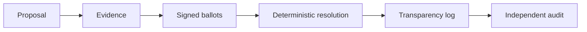

# Agent Governance Protocol (AGP)

**AGP is an experimental governance layer for multi-agent systems.**

It defines how independent agents or authorities can propose, review, approve,
reject, veto and audit high-impact decisions without trusting a single
coordinator as the sole source of truth.

> Status: experimental. AGP is not yet a production standard.


## Whitepaper

The current public review draft is:

**AGP Whitepaper v0.9.2 — A Deterministic Governance Layer for Multi-Agent Systems**

- [Read online](docs/whitepaper/AGP_Whitepaper_v0.9.2.md)
- [Download PDF](https://github.com/agpprotocol/agp/releases/tag/whitepaper-v0.9.2)
- [Submit technical feedback](https://github.com/agpprotocol/agp/issues/1)

The whitepaper is experimental, is not a production standard, and has not yet received independent security review.

## Why AGP?

- **MCP** connects models to tools and data.
- **A2A-style protocols** let agents communicate.
- **Workflow engines** coordinate execution.
- **AGP** governs collective decisions.

A workflow can record that a deployment was approved. AGP additionally aims to
make the authority snapshot, evidence, ballots, resolution and history
independently verifiable.

## Core properties

- deterministic resolution;
- canonical serialization;
- independent Python and Go implementations;
- Ed25519 signed envelopes;
- replay, expiration and revocation checks;
- append-only transparency log;
- external audit receipts;
- conformance and adversarial test vectors.

## Architecture



## AGP vs. a conventional workflow

| Property | Workflow | AGP |
|---|---:|---:|
| Coordinates steps | Yes | Yes |
| Deterministic replay across implementations | Not inherent | Yes |
| Signed authority actions | Optional/custom | Built into profile |
| Evidence version validation | Optional/custom | Yes |
| Revocation-aware decisions | Optional/custom | Yes |
| Tamper-evident history | Optional/custom | Yes |
| Independent audit without trusting coordinator | Not inherent | Yes |

AGP is intentionally more complex. For low-risk internal automation, a
conventional workflow is usually the better choice.

## Reproducible results

```text
AGP v0.3 Conformance:          260/260 passed
AGP v0.4 Signed Conformance:    10/10 passed
AGP v0.5 Transparency:           8/8 passed
AGP vs Workflow benchmark:       8/8 attacks detected by AGP
```

The workflow baseline in the benchmark detected 0/8 because it treated
coordinator state as authoritative. This is a limited experimental benchmark,
not a claim that all workflow engines are insecure.

## Quick start

Requirements:

- Python 3.10+
- Go 1.22+

```bash
git clone https://github.com/agpprotocol/agp.git
cd agp
python3 -m venv .venv
source .venv/bin/activate
pip install -r requirements-v0.4.txt
python3 run_benchmark_all.py
```

Expected final line:

```text
AGP BENCHMARK COMPLETE
```

## Repository map

```text
spec/           Conformance profile
python/         Python resolver
go/             Go resolver
signed/         Signed envelope conformance
transparency/   Append-only audit log
benchmark/      AGP vs workflow experiment
examples/       Reference scenarios
docs/           Architecture, threat model and evaluation
```

## What AGP does not claim

AGP does not:

- replace authentication, authorization or IAM;
- replace orchestration engines;
- guarantee that evidence is factually true;
- eliminate compromised members;
- solve governance for every multi-agent system;
- claim production maturity.

## Current research question

> Do high-impact multi-agent systems need a portable, independently verifiable
> governance layer distinct from communication and orchestration?

## Documentation

- [Architecture](docs/ARCHITECTURE.md)
- [Threat model](docs/THREAT_MODEL.md)
- [Benchmark](docs/BENCHMARK.md)
- [Roadmap](ROADMAP.md)
- [Contributing](CONTRIBUTING.md)
- [Security policy](SECURITY.md)
- [Governance](GOVERNANCE.md)

## License

Apache License 2.0. See [LICENSE](LICENSE).
