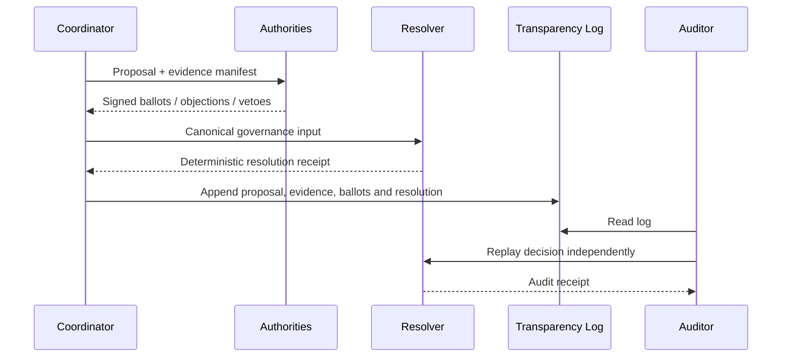

# AGP Architecture

## Scope

AGP governs decisions made by multiple independent authorities. It separates
communication, execution, governance and audit.

## Decision lifecycle

## Trust boundary

The coordinator is operationally useful but not fully trusted.

An auditor should be able to detect omitted or altered ballots, stale evidence,
revoked authorities, replaced decision roots, reordered or truncated history,
equivocation, invalid signatures and replayed envelopes.

## Layers

### Semantic layer

Defines proposals, membership snapshots, ballots, objections, vetoes, quorum
and deterministic resolution.

### Signature layer

Authenticates envelopes and applies replay, expiry, key validity and revocation
checks.

### Transparency layer

Maintains an append-only hash-linked event history and deterministic audit
receipts.

## Non-goals

AGP does not decide whether evidence is true. It verifies which evidence version
was governed and how the decision followed from the declared inputs.
